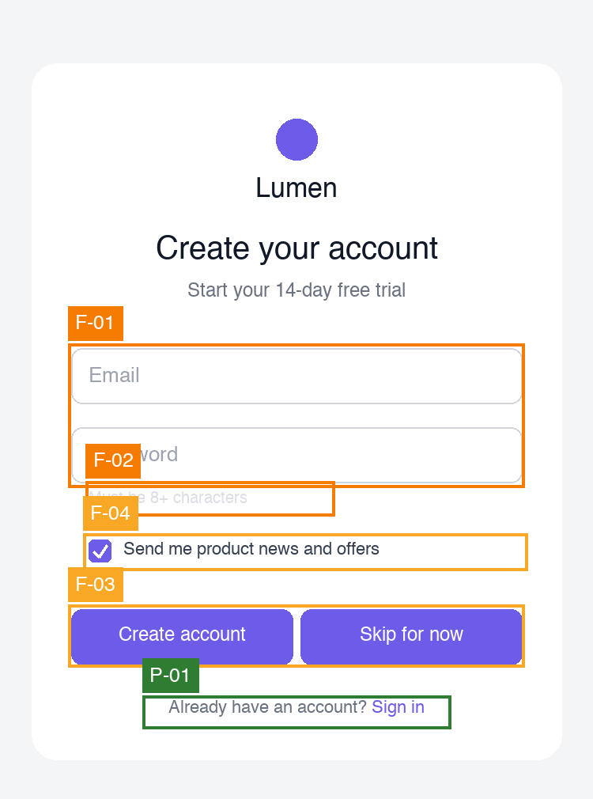

<p align="center">
  
  
  
  
  
</p>

<h1 align="center">🔍 UX Audit Skill</h1>
<h3 align="center"><em>Heuristic UX audits from screenshots</em></h3>

<p align="center">
  <strong>Point it at screenshots of a user journey. Get severity-rated findings, heuristic citations, annotated screenshots, and a structured report.</strong><br>
  <em>Graded against 16 named UX frameworks, not vibes. One skill, runs in both Claude Code and Codex.</em>
</p>

<p align="center">
  
</p>
<p align="center">
  <sub>Example output: a sign-up screen audited and annotated by severity (red = critical, orange = major, amber = minor, green = positive).</sub>
</p>

<p align="center">
  <a href="#what-you-get">What You Get</a> &bull;
  <a href="#why-it-works">Why It Works</a> &bull;
  <a href="#the-frameworks">Frameworks</a> &bull;
  <a href="#installation">Installation</a> &bull;
  <a href="#usage">Usage</a> &bull;
  <a href="#how-severity-works">Severity</a> &bull;
  <a href="#faq">FAQ</a>
</p>

---

## What You Get

You give the skill screenshots of a flow and one line about what the user is trying to do. It returns:

- **Severity-rated findings** on Nielsen's 0–4 scale, anchored to the user's actual goal
- **Heuristic citations** on every finding — "Nielsen #5", "WCAG 1.4.3", "Hick's Law" — never generic "make it pop" feedback
- **Annotated screenshots** with numbered, colour-coded markers
- **Recommended fixes** with effort estimates (S/M/L)
- **A structured Markdown report** with an executive summary, screen-by-screen findings, journey-level analysis, and what already works

It's a heuristic evaluation, the kind a senior designer does, run by an agent that has actually looked at your screens.

---

## What Are Agent Skills?

A skill is a folder with a `SKILL.md` file. The agent reads it and follows the instructions when a task matches. No plugin, no code to wire up. This one bundles a small Python script for the annotation step.

The same skill folder works in both tools — they read skills from different directories:

| Tool | Skills folder |
|------|---------------|
| **Claude Code** | `~/.claude/skills/ux-audit/` |
| **Codex** | `~/.codex/skills/ux-audit/` |

Both tools auto-invoke the skill when you ask for a UX audit. In Claude Code you can also call it explicitly as `/ux-audit`.

---

## Why It Works

Most AI design feedback is bad for predictable reasons. This skill is built to avoid each one:

| The usual problem | How this skill avoids it |
|-------------------|--------------------------|
| **"Make it pop" vagueness** | Every finding is evaluated against a *named* heuristic and cited |
| **Inconsistent results** | A fixed table of named checks means the same issue is flagged the same way every run |
| **Hallucinated issues** | Evidence rules forbid claims about anything not visible in a screenshot; interaction-only qualities are listed as "not assessable", never guessed |
| **No prioritisation** | Findings are severity-rated and sorted; you see the criticals first |
| **Not actionable** | Each finding carries a specific recommendation and an effort estimate |

The core idea: **the quality of the feedback depends on what you evaluate against.** Generic "review this design" prompts produce generic output. Evaluating a journey against established heuristic frameworks, with citations, produces the kind of review you'd pay a consultant for.

Under the hood it runs four passes over your screens: a **goal walk** (where does the journey break for the stated user), a **framework sweep** (all 16 below), a **named-checks** pass (stable IDs so audits are comparable over time), and a **journey-level** pass (cross-screen consistency, memory load, Peak–End, and a Fogg behaviour-model read of the key conversion action).

---

## The Frameworks

Findings are graded against 16 canonical frameworks, grouped by what they catch:

| Category | Frameworks |
|----------|-----------|
| **Classic usability** | Nielsen's 10 Heuristics · Shneiderman's 8 Golden Rules · Gerhardt-Powals' Cognitive Principles · Bastien & Scapin's Ergonomic Criteria |
| **Behavioural psychology** | Hick's Law · Fitts's Law · Miller's Law · Jakob's Law · Peak–End Rule |
| **Trust & persuasion** | Fogg Behaviour Model (B=MAP) · Cialdini's Principles of Influence |
| **Interaction design** | Gestalt Principles · Norman's Design Principles · Tognazzini's First Principles |
| **Accessibility** | WCAG 2.1 (the subset checkable from a static image) |
| **Content design** | 10 Content Design Heuristics |

Each framework's reference list and citation format lives in [`SKILL.md`](SKILL.md). Sources are linked at the bottom of every report.

---

## Installation

### Prerequisites

- [Claude Code](https://docs.anthropic.com/en/docs/claude-code) **or** [Codex](https://developers.openai.com/codex/cli/)
- **Python 3** with **Pillow** (for the annotation step): `pip3 install --user pillow`

### 1. Get the files

```bash
git clone https://github.com/EliaAlberti/ux-audit-skill.git
cd ux-audit-skill
```

### 2. Install into your tool

**Claude Code:**

```bash
mkdir -p ~/.claude/skills/ux-audit
cp -r SKILL.md scripts ~/.claude/skills/ux-audit/
```

**Codex:**

```bash
mkdir -p ~/.codex/skills/ux-audit
cp -r SKILL.md scripts ~/.codex/skills/ux-audit/
```

> Prefer to edit in place? Symlink instead of copy:
> `ln -s "$(pwd)" ~/.claude/skills/ux-audit`
>
> It's a standard `SKILL.md` skill, so any Agent Skills manager that installs from a GitHub repo works too.

### 3. Restart

Skills are discovered at startup. Restart Claude Code or start a new Codex session, then ask for a UX audit.

---

## Usage

Ask in plain language, or run `/ux-audit` in Claude Code. Point it at a folder of screenshots or attach them.

```
You: /ux-audit ./screenshots

Agent: I see 3 screenshots. Before I start, two things:
       What's the product, and what is the user trying to do in this flow?

You: A SaaS app — a first-time visitor signing up for the free trial.

Agent: Got it. Platform — mobile web? And should I run the full framework
       sweep or focus on specific concerns?

You: Mobile web, full sweep.

Agent: Done. 0 critical, 2 major, 2 minor.
       Report + annotated screens saved to ./ux-audit-2026-01-15-saas-signup/

       Top 3 fixes:
       1. Field labels are placeholder-only — they vanish on typing (WCAG 3.3.2)
       2. Password helper text fails contrast — the one rule users need is invisible (WCAG 1.4.3)
       3. Marketing consent is pre-ticked — dark pattern + likely GDPR issue

       Want me to open issues for the two majors?
```

### See a full example

A complete worked example lives in [`examples/`](examples/):

- [`examples/report.md`](examples/report.md) — the full audit report
- [`examples/assets/signup-annotated.png`](examples/assets/signup-annotated.png) — the annotated screen
- [`examples/make-example-mockup.py`](examples/make-example-mockup.py) — regenerates the example screen, so you can reproduce the whole thing

---

## How Severity Works

Findings are rated on Nielsen's 0–4 scale, weighted by **impact on the stated goal × how many users hit it × how often.** Anchoring to the goal is why the skill asks what the user is trying to do before it starts.

| Rating | Label | Meaning |
|:------:|-------|---------|
| 🔴 **4** | Critical | Blocks the goal, causes loss/harm, or legal/regulatory exposure — fix before release |
| 🟠 **3** | Major | Significant friction; many users struggle, some abandon |
| 🟡 **2** | Minor | Noticeable; users recover quickly |
| 🔵 **1** | Cosmetic | Polish — fix when convenient |
| 🟢 **✓** | Positive | Works well — keep and replicate |

Annotated screenshots use the same colour scale.

---

## What It Can't See

Honest limits. A static screenshot can't show behaviour, so the skill **never guesses** at it — these are listed in every report under "not assessable" rather than invented:

- Focus order and focus visibility
- Keyboard navigation and screen-reader semantics
- Motion, animation, transitions
- Latency and loading states
- Live interactive states not captured in the screenshots

For those, pair this with live/code-level accessibility testing.

---

## FAQ

<details>
<summary><strong>Does this work in both Claude Code and Codex?</strong></summary>

Yes. It's a single `SKILL.md` skill in the open Agent Skills format. Install it into `~/.claude/skills/` for Claude Code or `~/.codex/skills/` for Codex (or both). The instructions are tool-agnostic.

</details>

<details>
<summary><strong>How many screenshots should I give it?</strong></summary>

Anywhere from one screen to a full journey. More screens let it catch cross-screen issues (inconsistency, memory load, Peak–End), which single screens can't show. For very long flows (10+ screens) it batches by journey segment.

</details>

<details>
<summary><strong>Do I need Python?</strong></summary>

Only for the annotation step (drawing boxes on your screenshots), which uses Pillow. The findings and the written report don't need it. If Pillow isn't available, the skill falls back to an HTML overlay with the same colour-coded markers.

</details>

<details>
<summary><strong>Won't it just hallucinate problems?</strong></summary>

That's the failure mode this skill is designed around. Its evidence rules require every finding to point at something visible in a named screenshot, forbid stating inferred behaviour as fact, and force interaction-only qualities into a "not assessable" list. A framework that surfaces nothing gets no findings — it won't pad the count.

</details>

<details>
<summary><strong>Can I use it on a competitor's product?</strong></summary>

Yes. It only needs screenshots, so competitive teardowns and benchmark audits work exactly the same way.

</details>

<details>
<summary><strong>How do I get consistent results across audits?</strong></summary>

The Named Recurring Checks table in `SKILL.md` gives each common issue a stable ID (e.g. `CTA-AMBIGUITY`, `CONTRAST-FAIL`), so the same problem is labelled the same way every run. Extend the table with your own IDs as patterns recur in your product.

</details>

<details>
<summary><strong>Can I add my own domain checks?</strong></summary>

Yes. `SKILL.md` is just Markdown — add a section of domain-specific checks (fintech, healthcare, e-commerce, etc.) and they'll be applied alongside the frameworks. Keep them as named checks so findings stay comparable.

</details>

---

## Contributing

Issues and PRs welcome — especially new named checks, framework refinements, and the annotation fallback. See [`CONTRIBUTING.md`](CONTRIBUTING.md).

---

## Credits

Created by [Elia Alberti](https://github.com/EliaAlberti). The frameworks are the work of their original authors (Nielsen, Shneiderman, Gerhardt-Powals, Bastien & Scapin, Fogg, Cialdini, Norman, Tognazzini, the W3C, and others); each report links its sources.

---

## License

MIT. See [LICENSE](LICENSE).
