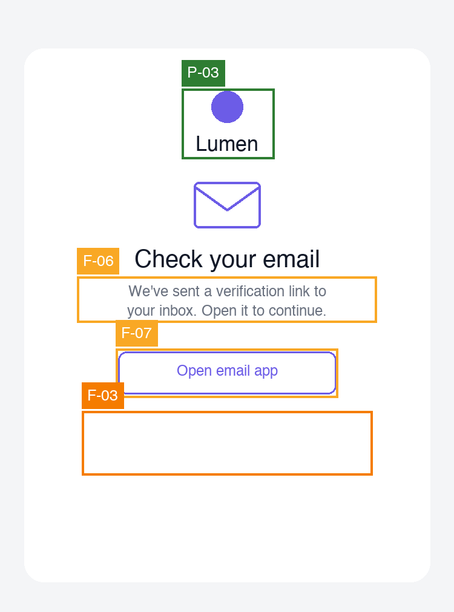

# UX Audit, Lumen: Sign-up & Verify

> This is an **illustrative example** produced by the `ux-audit` skill against two
> deliberately-flawed mockups ([`assets/signup.png`](assets/signup.png) and
> [`assets/verify-email.png`](assets/verify-email.png), generated by
> [`make-example-mockup.py`](make-example-mockup.py)).

## Executive Summary

This two-step sign-up gets the fundamentals right, few fields, a single column, a clear path for returning users, and a calm confirmation screen, but seven issues undercut the one job of the flow: getting a first-time visitor signed up and verified. On the form, field labels exist only as placeholder text that vanishes on typing (F-01) and the sole password rule is rendered at a contrast ratio that is effectively invisible (F-02). The journey then **ends on a dead end** (F-03): the verify screen offers no way to resend, change the address, or get help if the email never arrives, a weak final note that, by the Peak-End Rule, is what users will remember. Top three fixes: add persistent visible labels, fix the helper-text contrast, and give the verify screen real recovery options.

## Scope & Method

- **Goal evaluated:** A first-time visitor creates an account and reaches a verified state
- **User type / platform:** First-time · mobile web
- **Screens:**

| Step | File | Screen |
|------|------|--------|
| 1 | `signup.png` | Sign-up form |
| 2 | `verify-email.png` | Check-your-email / verification |

- **Frameworks applied:** Nielsen, Shneiderman, Gerhardt-Powals, Bastien & Scapin, behavioural laws, Fogg, Cialdini, Gestalt, Norman, Tognazzini, WCAG 2.1 (static subset), Content heuristics
- **Not assessable from static screens:** focus states, inline validation behaviour, whether labels float on focus, keyboard/screen-reader semantics, whether a resend exists but is hidden off-screen, the post-verification screen (not provided)

## Findings Overview

| ID | Sev | Screen | Check | Finding | Heuristics |
|----|-----|--------|-------|---------|------------|
| F-01 | 3 | 1 | FORM-FRICTION | Placeholder text is the only label on both fields | WCAG 3.3.2 · Content #1 · Nielsen #6 |
| F-02 | 3 | 1 | CONTRAST-FAIL | Password helper text is far below AA contrast | WCAG 1.4.3 · Nielsen #5 |
| F-03 | 3 | 2 | DEAD-END | Verify screen has no resend / change-email / help path | Nielsen #3 · Nielsen #9 · Tog: Explorable |
| F-04 | 2 | 1 | CTA-AMBIGUITY | "Create account" and "Skip for now" share identical weight | Hick's Law · Nielsen #6/#8 |
| F-05 | 2 | 1 | DARK-PATTERN | Marketing consent is pre-ticked | Cialdini (misuse) · Nielsen #3 |
| F-06 | 2 | 2 | TRUST-GAP | Verify screen never shows the address it sent to | Nielsen #1 · G-P #2 |
| F-07 | 2 | 2 | PATTERN-DRIFT | Primary button restyled between the two screens | Nielsen #4 · WCAG 3.2.4 |

## Screen-by-Screen

### Step 1: Sign-up form (`signup.png`)

#### [S3] F-01 · Placeholder-as-label on both fields
- **Check:** FORM-FRICTION · **Heuristics:** WCAG 3.3.2 (Labels or Instructions), Content #1 (front-load), Nielsen #6 (recognition over recall)
- **Evidence:** "Email" and "Password" appear only as grey placeholder text inside the inputs. There is no persistent label above either field.
- **Impact on goal:** Once the user starts typing, the only cue to what a field is for disappears, and assistive tech often skips placeholder text. Both raise error rates on the one form that gates sign-up.
- **Recommendation:** Add a persistent visible label above each field (or a float-on-focus label). Keep placeholders for format hints only. · **Effort:** S

#### [S3] F-02 · Password requirement is effectively invisible
- **Check:** CONTRAST-FAIL · **Heuristics:** WCAG 1.4.3 (Contrast AA), Nielsen #5 (error prevention)
- **Evidence:** "Must be 8+ characters" sits beneath the password field in a very light grey on white, visibly far below the 4.5:1 AA threshold (verify with a contrast checker).
- **Impact on goal:** This is the only guidance that helps users avoid a password rejection. If they can't read it, they fail validation and bounce off the step that matters most.
- **Recommendation:** Raise the helper text to at least 4.5:1 (e.g. #6B7280 on white). Consider showing the rule inline as the user types. · **Effort:** S

#### [S2] F-04 · Primary and secondary actions look identical
- **Check:** CTA-AMBIGUITY · **Heuristics:** Hick's Law, Nielsen #6/#8 (recognition, minimalist emphasis)
- **Evidence:** "Create account" and "Skip for now" are the same size, colour, and weight, side by side. Nothing signals which is the primary path.
- **Impact on goal:** The screen's goal is account creation, yet the design gives equal pull to skipping it.
- **Recommendation:** Make "Create account" the dominant button (filled, wider); demote "Skip for now" to a text/ghost link. · **Effort:** S

#### [S2] F-05 · Pre-ticked marketing consent
- **Check:** DARK-PATTERN · **Heuristics:** Cialdini (consent by default, not choice), Nielsen #3 (user control)
- **Evidence:** "Send me product news and offers" is ticked by default.
- **Impact on goal:** Erodes trust at the first interaction, and pre-ticked marketing consent is non-compliant under GDPR/PECR, which require a freely-given, affirmative opt-in. Flag for legal as well as UX.
- **Recommendation:** Ship the box unticked. · **Effort:** S

### Step 2: Check your email (`verify-email.png`)

#### [S3] F-03 · The journey ends on a dead end
- **Check:** DEAD-END · **Heuristics:** Nielsen #3 (user control & freedom), Nielsen #9 (help users recover), Tognazzini (explorable interfaces)
- **Evidence:** The only action is "Open email app". There is no "Resend email", no "Change email address", and no link to support anywhere on the screen.
- **Impact on goal:** Email verification fails often in the real world, typos, spam filtering, delays. When it does, this screen offers the user nothing. They cannot recover the goal without abandoning and starting over, which is exactly where sign-up funnels haemorrhage users.
- **Recommendation:** Add "Resend email" (with a short cooldown), "Change email address", and a help link. Consider showing a success state once verification is detected. · **Effort:** M

#### [S2] F-06 · The screen never says where it sent the link
- **Check:** TRUST-GAP · **Heuristics:** Nielsen #1 (visibility of system status), G-P #2 (reduce uncertainty)
- **Evidence:** The body reads "We've sent a verification link to your inbox" but never displays the email address it used.
- **Impact on goal:** A user who mistyped their address has no way to notice. Echoing the address back (e.g. "…sent to a\*\*\*@gmail.com") is the cheapest way to catch the error before it becomes a stuck account.
- **Recommendation:** Show the (masked) address the link was sent to, beside a "Change email" affordance. · **Effort:** S

#### [S2] F-07 · The primary button changes style between screens
- **Check:** PATTERN-DRIFT · **Heuristics:** Nielsen #4 (consistency & standards), WCAG 3.2.4 (consistent identification)
- **Evidence:** On screen 1 the primary action is a solid filled button; on screen 2 the primary action ("Open email app") is an outline button. Same role, different signifier, two screens apart.
- **Impact on goal:** Inconsistent primary-button styling makes users re-learn what "the main action" looks like at each step and subtly weakens trust in a flow that is asking for an email address.
- **Recommendation:** Use one primary-button style across the journey. · **Effort:** S

## Journey-Level Findings

- **Consistency is half-kept (F-07).** The brand mark is identical on both screens (see P-03), which is good, but the *primary button* is filled on step 1 and outline on step 2. When the obvious things stay constant and the important one drifts, the drift is more jarring, not less (Nielsen #4, WCAG 3.2.4).
- **The ending is the weakest moment (F-03).** By the **Peak-End Rule**, users disproportionately remember a journey's emotional low point and its ending. Here they are the same screen: the flow ends on an unrecoverable dead end. Fixing F-03 isn't just usability, it's what the user walks away feeling.
- **Fogg B=MAP on "verify your email":** the prompt is present ("Open email app"), but if the email doesn't arrive, **Ability** collapses to zero (no recovery) and **Motivation** with it. The verify step is where this funnel will leak most.

## What Works (keep)

- **[P-01] Clear path for existing users**: "Already have an account? Sign in" is present and legible, so returning users aren't trapped on the wrong screen (Jakob's Law, Nielsen #6).
- **[P-02] Minimal field count**: only email and password are requested, keeping Hick's-Law load and form friction low.
- **[P-03] Consistent brand mark**: the Lumen logo is identical across both screens, anchoring the user in the same product (Nielsen #4). The contrast with F-07 shows consistency is achievable here; it just needs to extend to the button.

## Prioritised Recommendations

1. **Quick wins (sev 3, effort S):** persistent labels (F-01); fix helper-text contrast (F-02)
2. **Planned (sev 3, effort M):** real recovery options on the verify screen, resend, change email, help (F-03)
3. **Quick wins (sev 2, effort S):** untick consent (F-05); dominant primary CTA (F-04); echo the masked email (F-06); one primary-button style across screens (F-07)

## Framework Coverage

| Framework | Findings |
|-----------|----------|
| Nielsen | F-01, F-03, F-04, F-05, F-06, F-07 |
| Hick / Fitts / Miller / Jakob / Peak-End | F-04 / none / none / P-01 / journey ends on a dead end (F-03) |
| Fogg B=MAP | Ability collapse at the verify step (F-03) |
| Cialdini | F-05 (consent by default); no positive trust signals present |
| Gerhardt-Powals | F-06 (reduce uncertainty) |
| WCAG 2.1 (static subset) | F-01 (3.3.2), F-02 (1.4.3), F-07 (3.2.4) |
| Content heuristics | F-01 |
| Tognazzini | F-03 (explorable / recoverable) |
| Gestalt / Norman / Shneiderman / B&S | No issues found in these two screens |

## Sources

Nielsen: nngroup.com/articles/ten-usability-heuristics · Laws: lawsofux.com · Fogg: behaviormodel.org · Cialdini: influenceatwork.com · WCAG: w3.org/WAI/WCAG21/quickref · Content design: contentdesign.london
